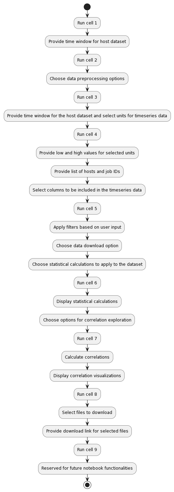
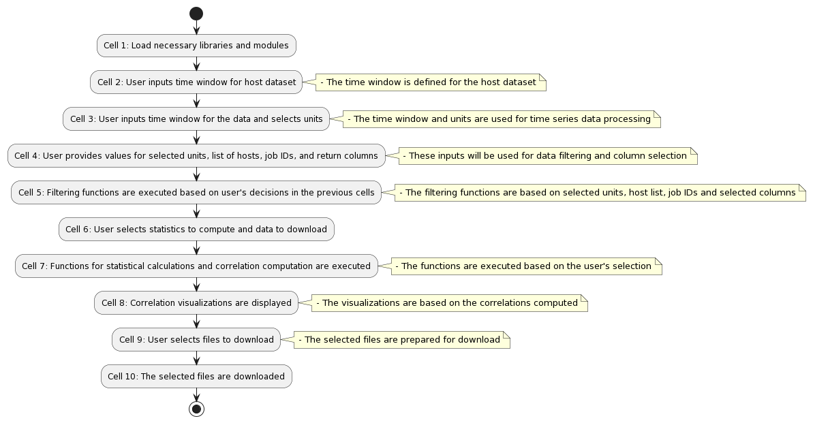

# FRESCO Analytic Notebook Design

## Purpose
The purpose of this document is to provide an understanding of the updated FRESCO analytics notebook design.

## Design
The UML diagram provides a general overview of the user's decision process. **Note** that this diagram is subject to change as the project progresses.

### Current user decision process:

### Current notebook cell relations:

## Individual Cells

### Cell 1
1. Imports required packages.
2. Requests the user to provide a time window for the host dataset.

### Cell 2
1. Asks the user for data preprocessing options. There are two options available:
   - Remove rows with missing metric values
   - Add an interval column

### Cell 3
1. Retrieves timeseries and account logs from the database using the time window provided.
2. Applies preprocessing options selected by the user in the previous cell.
3. Gives the user the option to select units to be included in the timeseries data.

### Cell 4
1. For each unit selected by the user, setup widgets to input low and high values.
2. Asks the user to provide a list of hosts to be included in the timeseries data.
3. Asks the user to provide a list of job IDs to be included in the timeseries data.
4. Gives the user an option to return account logs for the provided Job IDs.
5. Allows the user to select columns to be included in the timeseries data. If no column is selected, all columns are included.

### Cell 5
1. Applies filters based on unit values, hosts, and job IDs selected by the user.
2. Gives the user an option to download the filtered data.
3. Allows the user to select statistical calculations to be applied to the dataset. The options include:
   - Average
   - Mean
   - Median
   - Standard Deviation
   - PDF
   - CDF
   - Ratio of Data Outside Threshold

### Cell 6
1. Displays statistical calculations from the selected options.
2. Gives the user an option to explore correlations among metrics and statistics.

### Cell 7
1. Calculates correlations based on the user's choices in the previous cell.
2. Displays correlation visualizations.

### Cell 8
1. Provides the user with an option to select files to be downloaded.
2. Provides the download link for the selected files.

### Cell 9
1. This cell is reserved for any potential future additions to the notebook's functionalities.

