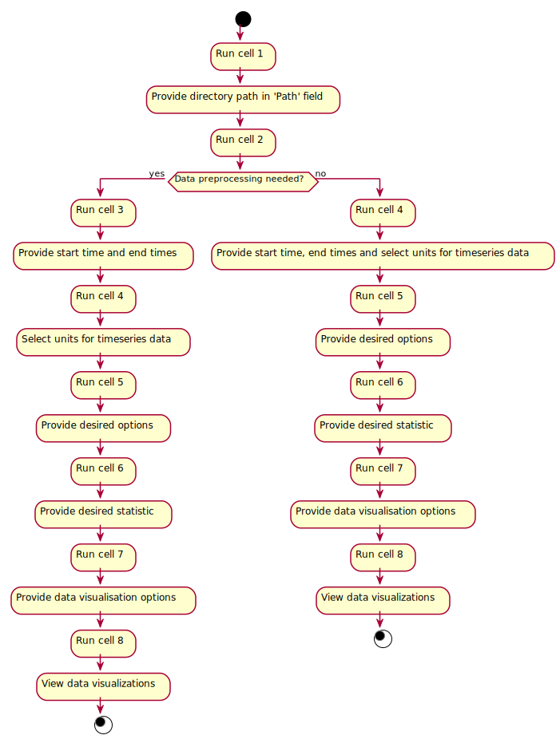

# FRESCO Analytic Notebook Design

## Purpose
The purpose of this document is to provide a place for everyone to understand and contribute to the design of the updated FRESCO analytics notebook.

## Design
The UML diagram below provides a general overview of the user's decision process. **Note** that this diagram is subject to change as the project progresses.

## Individual Cells

### Cell 1
1. Imports required packages
2. Asks the user for the directory path to the data. **TODO:** Update this since the user won't be accessing the data on their own computer. 

### Cell 2
1. Call the get_data_files_directory. **TODO:** Update this since the user won't be accessing the data on their own computer.
2. The user is given the option to preprocess the data to be analyzed. There are currently two options here:
- remove rows with missing metric values
- add an interval column

### Cell 3
1. If the user chose either preprocessing option, prompt the user for to provide a window of time for the data to be preprocessed.

### Cell 4
1. If the user chose either preprocessing option, run the corresponded function to preprocess the data.
2. If the user **did not** choose either preprocessing option, prompt the user for to provide a window of time for the data to be analyzed.
3. Provide the user the option to filter by any of the following metrics: 
- 'CPU %'
- 'GPU %'
- 'GB memused'
- 'GB memused_minus_diskcache'
- 'GB/s'
- 'MB/s'

### Cell 5
1. If the user selected a metric filtering option, prompt the user for a low and high value for each metric.
2. Provide the user the option to filter by:
- a list of nodes
- a list of job IDs
3. Provide the user the option to have a copy of the job accounting data returned for the job IDs found in the resultant time series dataset.
4. Provide the user the option to select which columns should be returned in the time series data.
- If none are selected, all are included.

### Cell 6
1. Run the data filtering functions as required by the user's selections in the previous cells.
2. Provide the user the option to run statistical calculations on the dataset generated by the filtering functions. The user is given the option to calculate:
- Average
- Mean
- Median
- Standard Deviation
- PDF
- CDF
- Ratio of Data Outside Threshold

### Cell 7
1. Run the statistical calculation functions.
2. Display the results of the calculations (including box and whisker plots).
3. Provide the user the option to see correlations between metrics. **Note** this prompt might have to be updated.

### Cell 8
1. Display correlation data and visualizations.

### Cell 9
1. Provide the user the option to download data any data.

### Cell 10
1. Download the desired data.